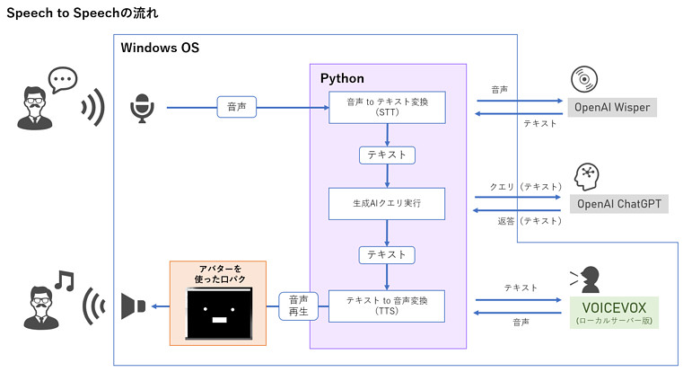
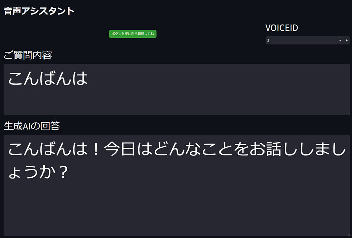

# speech-to-voicevox-speech-sample

話しかけた声を元に、生成AIで作成した回答をVOICEVOXの音声で返すサンプルです。  
アプリケーションの実行ファイル本体は以下に格納されています。

```
app/s2s-app.py
```

## 仕組み

基本的な処理の流れは下の図の通りとなってます。



- STT：音声のテキスト化
  - OpenAI Wisperを使用しています。
- LLM：テキストを元にした生成AIとの対話
  - OpenAI ChatGPT-4o-mini を使用しています。
- TTS：テキストの音声化
  - VOICEVOXのローカルインストール版を使用しています。
- UI
  - 入出力の内容を確認する用のUIをStreamlitで実装しています。

このアプリケーションではSpeech-to-Speechの部分のみを実装していますが、音声に合わせて反応するアバターを別途用意することで、キャラクターとの対話としても応用できます。

Windows PC用ですが、そのようなアバタープログラムもこちらで公開しています。  
https://github.com/u-tanick/m5stack-avatar-on-WinPC


## 実行環境

- Python 3.12 で動作確認済みです。
  - Python 3.13 は、まだ対応していないライブラリがある可能性があります。

- Python
  - 主なライブラリ
    - streamlit    // UI用
    - sounddevice  // 音声録音用
    - numpy        // 音声録音用
    - openai       // 生成AI用
    - requests     // REST-API呼び出し用(VOICEVOX)
    - pydub        // 音声再生用
    - など

インストールコマンド例（ほか足らないものあれば適宜追加してください）

''' sh
pip install streamlit
pip install openai
pip install sounddevice
pip install numpy
pip install requests
pip install pydub
pip install scipy
pip install sounddevice
pip install inspect
pip install logging.config
pip install functools
'''

- 個別インストール
  - VOICEVOX
    - ローカルインストール版を使用します。
      - Web APIを使用される場合は改修してください。
    - インストール手順など
      - https://voicevox.hiroshiba.jp/
      - https://yuushablog.info/voicevox-inst/
  - FFmpegのインストール手順
    - pydub ライブラリが参照するために必要です。
    - インストール手順など
      - https://ffmpeg.org/download.html
      - https://qiita.com/Tadataka_Takahashi/items/9dcb0cf308db6f5dc31b

- APIキー
  - OpenAIのAPIキーが必要です。
  - APIキーは `OSのシステム環境変数` または `ユーザー環境変数` に設定してください。
    - キー名：OPENAI_API_KEY

## 実行手順

1. VOICEVOXのアプリケーションを起動します。
   - アプリを起動させた状態でREST APIサーバーも立ち上がった状態になります。

2. appフォルダに移動して、以下のコマンドを実行するとブラウザが開き画面が立ち上がります。
   - ライブラリが足らないなどで起動に失敗する場合は適宜ライブラリを追加してください。

    ``` sh
    streamlit run s2s-app.py &
    ```

3. 画面上の `「ボタンを押したら質問してね」` ボタンを押し、話しかけるとVOICEVOCのずんだもん（ノーマル）の声で返事がきます。
   - 発話後に無音が2秒以上続いた時点で音声録音がストップし、対話処理に進みます。
   - 現時点では、対話履歴などの処理は実装していないため、会話は一回の応答で完結しています。
   - 画面右上のVOICEIDを変更することで、ずんだもん（ノーマル）以外の声に変えることも可能です。
     - VOICEVOXのスピーチID一覧
       - https://gist.github.com/u-tanick/1e27e681461496fd8d1a8792f971b398
     - こちらのサイトでIDの声を実際に確認できます
       - https://voicevox.hiroshiba.jp/




## 出典・参考・謝辞

STT, TTS部分の実装は、下記を多大に参考にさせていただきました。ありがとうございます。

- @mashmoeiar11さん  
  - [OpenAIの自動音声認識システムWhisperをつかってみる](https://qiita.com/mashmoeiar11/items/dc45be7252135b2173ca)

- @u0c8さん
  - [PythonでVOICEVOX APIを使ってwavを書きだす](https://qiita.com/u0c8/items/564046ef5a67a0639091)

- VOICEVOX
  - 利用規約
    - https://voicevox.hiroshiba.jp/term/
  - 本サンプルはローカル版のREST APIを利用させていただく仕組みとなっております。
